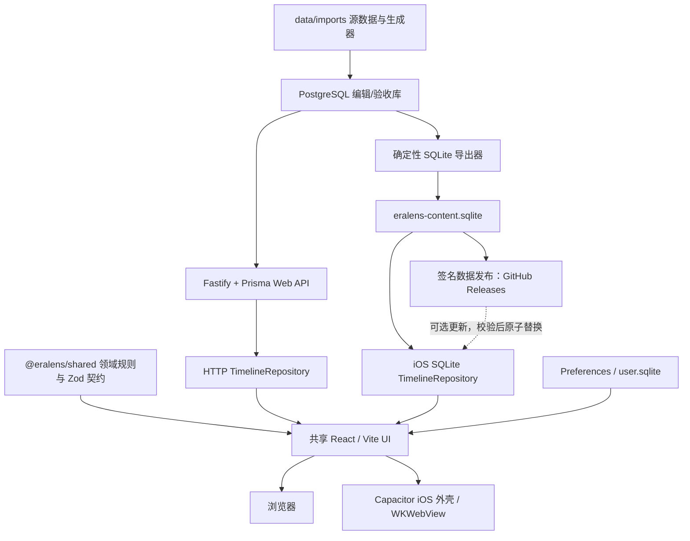

# EraLens Web → iPhone / iPad 迁移计划

> 状态：实施中（第 1 批已实现并通过临时干净库快照验收；第 5 批核心实现进行中）
> 编写日期：2026-09-27  
> 范围：保留现有 Web，新增离线优先的 iPhone / iPad 应用；两端共用主要代码与同一份历史数据源，并预留只更新历史数据的安全热更新通道。

## 1. 结论与关键决策

迁移采用 **React + TypeScript + Vite + Capacitor + WKWebView**。不另开仓库，不重写为 SwiftUI。现有时间轴、布局模型、共享领域规则和绝大部分组件继续复用；iOS 原生工程作为同一 monorepo 中的应用外壳存在。

数据采用以下分层：

1. `data/imports/` 继续作为历史事实的唯一来源，继续执行现有 generate → PostgreSQL → 校验 → 导入流程。
2. 发布 iOS 版本时，从校验通过的 PostgreSQL 数据库导出一个版本化的 **SQLite 内容快照**。
3. SQLite 基线快照随应用包发布；应用首次启动或内容版本变化时原子复制到应用容器，运行时查询始终使用本地数据库。
4. 用户设置、收藏和浏览位置与历史内容库分离，存入 Preferences 或单独的 `user.sqlite`，应用升级替换内容库时不丢失。
5. 可选的数据热更新只下载签名的数据快照，不下载或执行 HTML、JavaScript、CSS、Swift、SQL migration 或其他可改变应用功能的代码。

目标不是维护 Web 与 iOS 两套产品代码，而是维护：

- 一套 React 界面和交互模型；
- 一套 `@eralens/shared` 领域规则与 Zod 数据契约；
- 两个数据适配器：Web 的 HTTP 适配器、iOS 的 SQLite 适配器；
- 一个很薄的 Capacitor iOS 外壳。

当前官方文档显示 Capacitor v8 可接入现有 Web 项目，iOS 端使用 WKWebView，框架下限为 iOS 15+，要求 Xcode 26+。EraLens 的产品最低版本正式定为 **iOS/iPadOS 16.2**：当前 Web 样式在 21 个 CSS 文件中使用了 157 处 `color-mix()`，而该能力从 iOS/iPadOS 16.2 的 WebKit 才开始支持。`WKWebView` 随系统提供，不能由应用单独选择、固定或随包发布版本。实现时应在 lockfile 中固定完全相同版本的 `@capacitor/core`、`@capacitor/cli` 和 `@capacitor/ios`，不要在迁移过程中顺带升级到下一主版本。

## 2. 迁移目标与边界

### 2.1 必须完成

- Web 继续可独立构建、部署和使用现有 HTTP API。
- iPhone / iPad 在飞行模式、首次启动无网络的条件下仍可使用完整时间轴、搜索、详情和地图。
- 两端对相同数据给出相同的时间范围、卡片称谓、搜索结果、详情关联、正统色、并立布局和地图点。
- iPhone 和 iPad 均支持横屏、竖屏及运行中旋转。
- 竖屏时不设置固定的上下区域比例，也不要求时间轴与地图形成互斥的上下分区。地图图形的下边缘与扣除 safe area 后的可用内容区底部对齐，垂直方向不得居中；地图与时间轴继续共享同一个 `centerAbs`，拖动时间轴后地图立即反映同一历史时点。
- 触摸、鼠标、触控板和外接键盘均有可用交互。
- iOS 核心功能不依赖 Fastify、Prisma、PostgreSQL、远程字体或网络；数据更新检查失败、GitHub 不可达或用户离线时仍完整可用。

### 2.2 本轮不做

- 不把全部界面改写为 SwiftUI。
- 不让 iOS 直接执行 `data/imports/**/import.sql`；这些 SQL 使用 PostgreSQL 方言，不适合设备端。
- 不在 iOS 上运行 Node.js / Fastify 服务。
- 首批可以只交付随包数据库，但数据库 metadata、版本兼容和原子替换协议按未来热更新要求实现，避免后期重做。
- 不通过热更新改变 SQLite schema、领域规则、查询逻辑或 UI；这些变化必须发布新的 App Store / TestFlight 应用版本。
- 不在迁移中改变已有历史数据判定、正统规则或称谓规则；发现数据问题仍回到导入源修复。

## 3. 当前系统基线

### 3.1 可以直接复用的部分

- `apps/web/`：React 19、TypeScript、Vite、TanStack Query、Zustand、Framer Motion。
- `packages/shared/`：Zod 契约、AbsMonth、区间归属、称谓、泳道分组、命运线、搜索与详情构造等领域规则。
- `apps/web/src/data/repository.ts`：已经存在 `TimelineRepository` 抽象，是切换 HTTP / SQLite 的天然接缝。
- 时间轴查询已按 LOD 分块并预取相邻块，适合本地 SQLite 的窗口查询。
- 标尺、地图拖动已大量使用 Pointer Events，具备触屏适配基础。
- 小屏下详情已经改为底部抽屉，可继续演进成 iOS sheet 风格。

### 3.2 迁移前必须处理的差异

- 当前地图已经拆成 `ChinaMapBackground`、`CapitalMapLayer` 和 `EventMapLayer`，三者共用 `resolveChinaMapLayout()` / `projectGcj02()`。竖屏底部对齐只需扩展共享布局函数和容器状态，不能让三个图层分别计算位置。
- `HoverTooltip` 只监听鼠标事件；触屏上没有可靠 hover。
- 时间轴缩放主要依赖 wheel 和 WebKit gesture 事件，需要补充统一的双指缩放与触摸命中规则。
- `AppShell` 直接根据环境变量调用 `/settings/events` 或 `localStorage`，平台分支泄漏到了界面层。
- `selectionStore` 直接写浏览器 URL 和 `localStorage`，iOS 需要通过平台服务决定是否同步 URL。
- `index.html` 从 Google Fonts 加载字体，不满足完全离线；字体必须随包分发或改用系统字体。
- Web 数据来自 PostgreSQL 特性：数组、JSON、`int4range`、GIN、触发器和生成列；SQLite 快照需要显式转换。
- 目前没有 iOS 工程、移动端 E2E、XCUITest 或构建流水线。
- Skill 枚举与实现存在一处已知漂移：共享 schema 和真实数据包含 `agriculture`，但时期/事件 Skill 的事件枚举清单没有列出。迁移前要统一文档、Zod、Prisma、标签、样式和 SQLite schema。

### 3.3 当前数据规模参考

仓库盘点时，`data/imports/` 约 6.3 MB、40 个导入目录，生成 SQL 合计约 4.2 MB；manifest 汇总至少包含约 1,448 人物、1,220 个 reign、440 个事件、198 个都城以及 876 条关系。该规模适合随应用附带 SQLite，不需要为了首版引入分包下载。

## 4. 统一技术架构



### 4.1 框架选型

| 层 | 选型 | 决策理由 |
|---|---|---|
| 共享 UI | React 19 + TypeScript + Vite | 直接复用当前代码、CSS、SVG 和布局模型 |
| 状态 | Zustand + TanStack Query | 保留现有视口和选择状态；Query 继续负责分块缓存 |
| 领域规则 | `@eralens/shared` | 所有时间、称谓、正统、边界和关系语义保持单实现 |
| iOS 容器 | Capacitor v8 + WKWebView | 可嵌入现有 Vite 构建，同时允许通过插件访问原生能力 |
| iOS 内容数据 | SQLite | 单文件、索引查询、事务校验、适合应用内离线数据 |
| iOS SQLite 访问 | `@capacitor-community/sqlite`，封装在自有 `SqliteDriver` 后 | TypeScript 可直接实现仓库适配器；社区插件只作为驱动，不让其 API 扩散到组件层 |
| 驱动后备 | 本地 Swift Capacitor 插件 + 系统 SQLite | 若社区插件与锁定的 Capacitor / Xcode 组合不兼容，只替换 `SqliteDriver`，不改上层仓库与 UI |
| 小型设置 | `@capacitor/preferences`；Web 使用 localStorage 或现有 API | 设置量小，和历史内容库分离 |
| iOS 工程 | Xcode，原生依赖优先 Swift Package Manager | 便于签名、模拟器、真机、TestFlight 和 App Store 构建 |

选择 Capacitor 而不是 React Native / Expo，是因为 EraLens 的价值集中在现有 HTML/CSS/SVG 时间轴和精细布局；React Native 会要求重写视图层。选择 Capacitor 而不是手写 WKWebView 外壳，是为了使用标准化的构建同步、插件桥接和 iOS 工程生命周期。

### 4.2 iOS 与 WebKit 兼容基线

最低版本决策：

- App target 的 `IPHONEOS_DEPLOYMENT_TARGET` 固定为 `16.2`，同时适用于 iPhone 和 iPad。
- Capacitor v8 的框架下限是 iOS 15；当前 `@capacitor-community/sqlite` v8 的 Swift Package 和 Podspec 下限也是 iOS 15，因此两者不会把产品下限继续提高。
- 当前代码使用的 Pointer Events、`ResizeObserver`、`100dvh`、SVG 和基础 Web API 不高于上述产品基线；决定性能力是 `color-mix()`。它被设计系统、时间轴卡片、地图和详情面板广泛使用，缺失时会造成大量颜色声明失效，不能视为可接受的轻微降级。
- 当前 7 处 `backdrop-filter` 应补充 `-webkit-backdrop-filter`，并保留不依赖模糊效果的实色背景；模糊效果不得成为信息可读性的前提。
- Vite 的 iOS production build 明确设置 JavaScript/CSS 目标为 `safari16.2`。构建目标只负责语法转换，不会自动补齐 Web API；每次引入新的 Web API、CSS 能力或原生插件仍须重新审计。
- 不通过 User-Agent 假定 WebKit 能力。可选增强使用 `CSS.supports()` 或特性检测；核心功能在最低系统版本必须直接可用。

工程创建后，把最低版本写入 Xcode project；若使用 CocoaPods，同时写入 `platform :ios, '16.2'`。依赖声明可以保留自身较低的 iOS 15 下限，但 App target 不得低于或高于 16.2 而没有经过记录的产品决策。

最低版本只能在以下条件同时满足时调整：

1. Capacitor、全部原生插件和原生 API 的下限审计完成；
2. WebKit 能力清单及必要 fallback 已完成；
3. 最低版本模拟器或真机完成离线、SQLite、横竖屏、触控和性能回归；
4. 变更被分类为应用发布，不能作为纯数据更新发布。

### 4.3 建议的仓库结构

```text
apps/
  api/                         # 保留：Web API + PostgreSQL
  web/                         # 共享 React/Vite 应用
  ios/                         # 新增：Capacitor 配置、iOS 脚本与 Xcode 工程
    capacitor.config.ts
    ios/
    resources/
packages/
  shared/                      # 保留：领域规则和 DTO/Zod 契约
  data-access/                 # 新增：Repository 接口、平台选择、SQLite 映射
data/
  imports/                     # 唯一历史事实源
  mobile/                      # 生成物目录；数据库本体不手改
    schema.sql
    eralens-content.sqlite
scripts/
  export-mobile-sqlite.mjs     # PostgreSQL → SQLite
  validate-mobile-sqlite.mjs
```

`apps/ios/ios` 是否提交版本控制，在第 1 批原型后固定策略。建议提交原生工程，因为 Bundle ID、签名能力、Info.plist、图标、启动屏、原生插件和测试目标都属于产品代码；生成的 Web 资源与 `.sqlite` 可由 CI 重建。

### 4.4 应用启动时的平台装配

在 React 启动前只做一次依赖选择：

```text
Browser / Web build  -> HttpTimelineRepository + WebSettingsRepository
Capacitor iOS build  -> SqliteTimelineRepository + NativeSettingsRepository
Test                 -> InMemoryTimelineRepository
```

组件只调用 `TimelineRepository`、`SettingsRepository` 和 `NavigationState`；组件内不再读取 `VITE_DATA_SOURCE`、不直接 `fetch`、不直接判断 Capacitor 平台。

现有 `TimelineRepository` 方法继续作为两端契约：

- `getTimeline()`
- `getTimelineCatalog()`
- `getEntity()`
- `search()`
- `getBounds()`
- `getCapitals()`

当前未在 HTTP 实现的 `getPersons/getReigns/getEvents` 要么从接口移除，要么在两端补齐；不能长期保留只在 mock 可用的契约。

## 5. 数据统一管理方案

### 5.1 唯一来源和三种形态

| 形态 | 用途 | 是否人工编辑 |
|---|---|---|
| `data/imports/{slug}/` 源数据、生成器、manifest | 历史资料维护和审计 | 是，唯一允许编辑的事实源 |
| PostgreSQL | 开发、全量导入、Web API、复杂审计 | 否，由 imports 生成 |
| SQLite 内容快照 | iOS 离线发布与本地查询 | 否，由 PostgreSQL 导出 |

禁止从 iOS SQLite 反向改历史资料。历史数据通过 PostgreSQL 导入 SQL 维护，SQLite 内容快照由 PostgreSQL 导出。

### 5.2 SQLite 内容 schema

逻辑实体与现有 Prisma 保持一致：

- `persons`
- `dynasty_groups`
- `dynasties`
- `reigns`
- `events`
- `event_locations`
- `event_dynasties`
- `event_participants`
- `relations`
- `dynasty_lane_groups`
- `dynasty_capitals`
- `reign_capitals`
- `content_metadata`
- `search_entries`

适配规则：

- PostgreSQL `text[]` 在 SQLite 中使用 JSON 文本，读出后统一映射为数组；连接关系仍使用连接表。
- `links` 等 JSON 字段保存为 UTF-8 JSON 文本，并在导出时解析校验。
- 不复制 `int4range` 和 `span` 生成列；窗口查询统一使用 `start_abs <= :to AND end_abs >= :from`。
- 不复制 GIN；导出时生成扁平 `search_entries`，保存归一化词、实体引用、标签、副标题和时间锚点，并建立普通索引。首版先复现现有搜索语义，只有性能数据证明需要时才引入 FTS5。
- 保留 `start_abs/end_abs/at_abs` 及相关复合索引，避免运行时重复计算 AbsMonth。
- `content_metadata` 至少包含 `schema_version`、`dataset_version`、`source_git_sha`、`source_checksum`、各表计数和构建时间。

### 5.3 导出流水线

```text
生成全部 import.sql
  → validate-import
  → 导入临时 PostgreSQL
  → 运行现有称谓、先秦姓氏、接续边界等审计
  → 按主键稳定排序读取 PostgreSQL
  → 写入临时 SQLite
  → 建索引和 search_entries
  → Zod 解析抽样及全量关键 DTO
  → PRAGMA foreign_key_check / integrity_check
  → 与 PostgreSQL 做查询契约对比
  → 写 metadata 和 checksum
  → 原子发布 eralens-content.sqlite
```

建议新增命令：

```bash
pnpm data:mobile:build
pnpm data:mobile:validate
pnpm data:mobile:diff
```

`data:mobile:diff` 输出上一个发布快照与新快照的表计数、实体增删和 schema 版本变化，避免无意把大量数据漏出发布包。

### 5.4 应用内数据库生命周期

1. 应用包包含只读的 `eralens-content.sqlite` 和 checksum。
2. 首次启动复制到 `Application Support/EraLens/Content/{datasetVersion}/content.sqlite.tmp`。
3. 对临时文件执行 checksum、`integrity_check` 和 schema 版本检查。
4. 验证通过后原子重命名为 `content.sqlite`；失败时保留上一版本。
5. 内容连接以只读方式打开；不允许历史内容在设备上被修改。
6. 新应用版本携带更高 `dataset_version` 时重复上述替换过程。
7. 用户数据存放在另一文件或 Preferences 中，不随内容库替换。

如果驱动支持直接以只读方式打开 Bundle 内数据库，可在原型中测量后省略复制；正式方案仍须保证版本检测和失败回退。

### 5.5 两端一致性测试

对固定测试窗口同时调用 HTTP 仓库与 SQLite 仓库，比较经过 Zod 解析和稳定排序后的结果：

- 夏商周、公元前后交界、三国、南北朝、隋唐、宋辽金、明清、近现代；
- `month/decade/century/millennium` 四个 LOD；
- 空窗口、只有事件没有王朝的窗口、并立 claim track、缺载 reign；
- 五类详情：dynasty、reign、person、event、capital；
- 人名、别名、朝代+庙谥、年号、都城、事件、成语搜索；
- 都城时间归属、事件地点、命运关系；
- bounds、catalog、事件显示设置。

允许数组顺序不同的字段必须先按项目定义的稳定规则排序；其余字段要求深度相等。

### 5.6 可选数据热更新架构

热更新采用“**内置基线库 + 本地当前库 + 远程候选库**”三层模型：

```text
应用内置 baseline.sqlite
          ↓ 首次安装 / 本地库不可恢复
Application Support/current.sqlite  ← 应用始终从这里查询
          ↑ 校验通过后原子替换
Application Support/candidate.sqlite.tmp ← GitHub 数据发布包
```

启动流程：

1. 立即打开最后一份校验通过的本地库并呈现界面，不等待网络。
2. UI 可交互后异步请求一个很小的 `latest.json`，使用 ETag / `If-None-Match`，避免每次下载正文。
3. 若远程 `datasetVersion` 更新且兼容当前应用，下载到临时文件，并显示可取消的进度；大文件或蜂窝网络可要求用户确认。
4. 校验签名、SHA-256、文件大小、SQLite header、`schemaVersion`、`contractVersion`、`minAppBuild`、`integrity_check`、`foreign_key_check` 和必要计数。
5. 验证通过后关闭旧连接，原子替换数据库，重新打开并清空 TanStack Query 的历史数据 cache，同时保留 `centerAbs`、当前选择和界面设置。
6. 任一步失败都删除候选文件、记录非敏感错误并继续使用原库；不能把更新失败变成启动失败。
7. 保留一份上一版本库用于回退；新库成功打开并完成一次冒烟查询后再清理更旧版本。

远程 manifest 建议格式：

```json
{
  "formatVersion": 1,
  "datasetVersion": "2026.10.03.1",
  "schemaVersion": 1,
  "contractVersion": 1,
  "minAppBuild": 1,
  "sourceGitSha": "...",
  "url": "https://github.com/OWNER/REPO/releases/download/data-2026.10.03.1/eralens-content.sqlite.zst",
  "compressedSize": 1234567,
  "uncompressedSize": 4567890,
  "sha256": "...",
  "signature": "base64-ed25519-signature",
  "counts": {
    "persons": 1448,
    "reigns": 1220,
    "events": 440
  }
}
```

安全和分发要求：

- manifest 使用离线保管的 Ed25519 私钥签名；应用只内置公钥。SHA-256 和 manifest 放在同一可修改位置只能发现传输损坏，不能防止仓库或账号被攻破。
- 每个数据版本使用不可变 URL 和独立 Git tag；推荐 GitHub Releases asset，并启用 immutable releases。不要让客户端直接下载会被覆盖的 `main` 分支数据库。
- `latest.json` 只作为指针，真正的数据包 URL、hash 和版本不可变。可放 GitHub Pages 或一个静态 HTTPS 地址。
- 不在客户端放 GitHub token 或 client secret。若通过 GitHub REST API 查询 latest release，公共匿名请求有频率限制；更稳妥的做法是直接 GET 静态 manifest，并使用 HTTP cache header。
- 远程包只包含符合应用已知 schema 的 SQLite 数据。不得包含脚本、触发器、可执行 SQL、Web bundle、插件或动态 UI 配置。
- schema DDL、SQLite migration 和查询代码随应用发布。远程数据库的 `schemaVersion` 高于应用支持版本时，只提示“需要更新应用”，绝不尝试执行远程 migration。
- Apple 规则禁止下载会引入或改变功能的代码；因此数据更新必须严格限定为历史内容行和预计算索引。审核备注中应说明数据包格式、签名、兼容检查与离线回退。
- 若更新内容可能显著改变用户看到的史实，应用内提供数据版本、更新时间、变更摘要和回退到内置版本的诊断入口。

下载实现优先使用原生 `URLSessionDownloadTask` 封装成 Capacitor 插件，将响应直接写入临时文件，避免把整个数据库经过 JavaScript bridge 放进内存。首版不需要后台常驻任务；只在启动后、进入前台或用户点击“检查数据更新”时检查，并对失败进行指数退避。

### 5.7 发布前判断“仅数据更新”还是“必须发应用”

不能只根据“改动位于 `data/imports/`”判断。事实数据保存在各包 `cache.json`，统一生成器和 SQL 序列化器也属于数据基础设施。发布分类必须同时检查：**Git 改动路径、运行时契约指纹、最终 SQLite 内容**。

#### 自动分类结果

新增：

```bash
pnpm release:classify --base <last-data-tag-or-app-tag>
```

输出只能是三种：

- `DATA_ONLY`：允许发布签名数据包；
- `APP_RELEASE_REQUIRED`：必须构建和审核新应用；
- `MANUAL_REVIEW`：路径或生成逻辑发生变化，机器不能证明是纯数据。

#### `DATA_ONLY` 的全部条件

- 运行时代码无变化：`apps/**`、`packages/shared/**`、`packages/data-access/**`、Capacitor/Xcode 工程、CSS、字体、地图资产和依赖 lockfile 均未变。
- 数据基础设施无变化：Prisma schema/migration、SQLite DDL、导出器、公共生成器 `data/imports/lib/**`、校验脚本和搜索归一化逻辑未变。
- `schemaVersion`、`contractVersion`、表/列/索引指纹、枚举集合和 Zod DTO 兼容性未变。
- 变更只造成允许表中的 INSERT/UPDATE/DELETE 和预计算索引内容变化。
- 新旧 SQLite 都通过完整性、外键、Skill 审计、Zod、查询契约和行级 diff 检查。
- 新 manifest 的 `minAppBuild` 不高于当前 App Store 最低可用 build；所有仍受支持的应用版本都能读取该数据包。
- 数据变更摘要经过人工历史内容复核并签名发布。

#### 必须发布应用的改动

- React/TypeScript/CSS/Swift/Capacitor 插件、交互、布局、地图投影或查询行为改变。
- `@eralens/shared` 中 AbsMonth、边界归属、称谓、正统、泳道、命运线或搜索规则改变。
- 新增/删除/重命名表、列、枚举或关系；`schemaVersion` / `contractVersion` 改变。
- 新事件类型需要新标签、颜色、图形或筛选项。
- 新数据依赖未随旧应用提供的字体、图片、地图或其他资源。
- 需要执行 SQLite migration、触发器、view、SQL 脚本或任何远程逻辑。
- 修复的是展示/查询代码问题，即使症状只出现在某条数据上。

#### 必须人工复核的改动

- 统一生成器或共享 SQL 序列化器发生变化，因为这会改变所有缓存包的 SQL 输出。
- manifest notes/sources 之外的导入包结构调整。
- 表计数发生异常幅度变化、某个时期整体消失、主键大规模重命名或关系大量删除。
- 导出器生成的 search entries、AbsMonth 或预计算字段变化，但源数据 diff 无法直接解释。

事实记录应直接维护在各包的 `cache.json`；包级生成器不再各自保存事实或特殊处理。这样路径分类器才可能稳定地把纯内容提交判为 `DATA_ONLY`。

#### CI 发布门禁

```text
比较 last release tag 与 HEAD
  → changed-path classifier
  → 分别构建基线与候选 SQLite
  → 比较 schema / contract fingerprint
  → 输出 row-level data diff
  → 运行全部数据审计与 Repository 契约测试
  → DATA_ONLY / APP_RELEASE_REQUIRED / MANUAL_REVIEW
  → DATA_ONLY 才允许签名并创建不可变 GitHub Data Release
```

如果分类器与人工判断冲突，采用更严格结果；不能通过手工设置环境变量强制把 `APP_RELEASE_REQUIRED` 降级成 `DATA_ONLY`。

## 6. 从现有 Skill 与代码提取的需求清单

以下要求是迁移的兼容性基线。迁移不能借平台变化重新解释这些语义。

### 6.1 历史时间与区间

- 全系统使用 `AbsMonth`：`toAstroYear(year) * 12 + month - 1`，公元前年份负数存储且无公元 0 年。
- 年精度点事件落在 12 月年桶右缘；泳道起年和迄年占位分别为 1 月、12 月，UI 不把占位月显示成已知月份。
- point / span / circa 各自保持明确含义；不以 span 表示“大约”。
- 农历月日不得直接当作公历月日；无可靠换算时保留原记载并降低精度。
- 相邻区间归属统一使用 `timelineOwnership.ts` / `timelineIntervals.ts`，不能在 SQLite 查询、iOS 组件或 Swift 中再写一套 `+1 年/月` 规则。
- 年精度顺序继位默认旧王占死年、新王从下一年起；短祚、未逾年改元、真正并立及同年可核时长按现有例外数据处理。
- 史料缺、无国君、已知人但年代推算、已知 N 位失名君主四类情况必须保持区分。

### 6.2 王朝、在位与称谓

- 普通 reign 与缺载 reign 共用 `Reign`、布局和坐标路径。
- `claim_track` 表达同时并立，`dynasty_groups` 表达同时并存政权，`dynasty_lane_groups` 表达前后相续泳道，三者不能互换。
- `is_main` 和正统窗口控制金色覆盖；王朝本色不能写成 `gold`。
- 卡片宽度严格服从时间几何，移动端不能为了塞字而扩大时长。
- `persons.name`、姓、氏、谥号、庙号、年号、`reigns.title` 保持字段职责，不因移动端显示空间不足而合并字段。
- 称谓解析继续使用共享规则；明清年号优先、先秦称号、唐至元庙号等现有规则保持一致。
- 人物/在位详情需保留身份、世系/继承背景、年代、相关人物或政权和关键事迹。

### 6.3 事件、人物与关系

- 事件层只展示王朝泳道、在位和都城不能表达的信息。
- 事件种类、精度、时间模式必须通过共享 Zod 枚举；新增枚举同步 Prisma、标签、样式、Skill 和 SQLite 导出。
- 当前代码已包含 `agriculture`，应在迁移第 0 批补齐 Skill 文档。
- 事件必须保留 dynasty、participant、location 关联；国君参与者引用 person，不引用 reign。
- 非君主人物有可核生卒时显示在人物层；君主不重复进入人物层。
- 跨王朝命运线只表达 killed、surrender、abdication、captured，并继续使用共享端点解析与布局。
- 年精度事件名在事件轴仍位于视口时必须可见。

### 6.4 地理与地图

- 都城保留 primary / secondary / temporary、时间段、claim track 及可选 reign 显式关联。
- 都城坐标使用 GCJ-02；事件地点使用 WGS84；显示事件点时沿用现有 WGS84 → GCJ-02 转换。
- 地点不确定性、代表点和范围说明必须进入数据，地图层不得制造虚假的精确位置。
- 地图运行时不调用外部地图服务；中国轮廓、坐标和字体资源均随包提供。
- 地图与时间轴共享历史时间视口，中心年份改变后都城与事件地点同步更新。

### 6.5 查询与展示

- 按 LOD 分块查询、相邻块预取和稳定合并继续保留。
- 搜索必须覆盖人物名、别名、姓氏组合、谥号、庙号、王朝组合词、年号、事件、都城古今名。
- 点击王朝、reign、人物、事件、都城打开同一详情体验，并保留详情内关联导航与返回历史。
- 详情抽屉、搜索、事件筛选、地图缩放、时间轴平移/缩放都必须离线工作。
- Tooltip 年份继续用紧凑格式，如“前221年”。

### 6.6 数据维护约束

- 真实数据只改 `data/imports/{slug}/`，不改 `data/seed/*.json` 修生产数据。
- 数据修复优先回到数据源，不在 Web、iOS 或 API 按实体 id hardcode。
- 新 schema 字段或枚举必须同步 Prisma、Zod、共享逻辑、Skill、SQLite schema、导出器和两端仓库。
- 所有生成与发布都必须保留 manifest sources / notes 的可追溯性。

## 7. 横竖屏与交互设计

### 7.1 组件边界

保留当前 `TimelineStage` 的叠层结构，不为了 iOS 另建 `TimelineWorkspace` 或 `HistoricalMapViewport`，也不把地图移动到独立区域。现有地图边界已经足够：

- `ChinaMapBackground`：中国轮廓；
- `CapitalMapLayer`：都城点；
- `EventMapLayer`：事件地点；
- `resolveChinaMapLayout()` / `projectGcj02()`：三层共用的地图尺寸、位置和坐标投影。

竖屏调整集中在共享地图布局函数：为布局输入增加明确的垂直对齐模式，portrait 使用 `bottom`，其他布局沿用经验证的行为。中国轮廓、都城点和事件点必须读取同一份布局结果，不能在各组件中分别增加偏移。`TimelineStage` 继续管理地图拖动、缩放、时间状态和图层顺序。

详情展示可以继续按现有组件演进为桌面侧抽屉、手机底部 sheet 和 iPad 侧 sheet；这项工作不要求拆分地图。

### 7.2 竖屏布局规范

对 iPhone/iPad 的竖向可用内容区（扣除 safe area；顶部工具栏的归属在视觉稿中固定）不设置固定行高比例，不增加用于维持比例的分隔线。事件、王朝泳道、人物层和时间标尺按可用空间正常布局；地图继续作为 `TimelineStage` 内的叠层，并通过共享地图布局结果贴合底部。

布局计算语义示例：

```ts
const top = alignment === "bottom"
  ? containerHeight - insets.bottom - mapHeight
  : insets.top + (availableHeight - mapHeight) / 2;
```

实际计算继续封装在 `resolveChinaMapLayout()` 中，并同时供轮廓、都城和事件投影使用。

时间轴内容：

- 顶部浮动品牌、搜索和事件筛选；
- 可纵向滚动的事件 + 王朝泳道 + 人物层；
- 时间标尺保持在时间轴交互层中；
- 横向拖动标尺或时间轴平移历史时间；
- 双指缩放以手势中心为锚点。

地图：

- 不规定地图占据视口的固定高度或比例；地图图形的下边缘与可用内容区底部对齐，水平方向可以居中，垂直方向不得居中；
- 地图尺寸由容器尺寸、地图固有宽高比和可读性约束共同决定，不能通过空白占位模拟固定比例；
- 显示时间轴中心时点对应的都城和附近事件；
- 地图拖动只改变地图偏移，不改变时间；
- 地图双指缩放只改变地图比例，不缩放时间轴；
- 继续沿用现有 z-index、裁剪范围和手势命中边界；调整定位后复核地图图形之外的时间轴操作不被阻断；
- safe area 或窗口高度变化后重新计算底部锚点，不能退回垂直居中。

详情打开时：

- iPhone 以底部 sheet 覆盖显示，支持关闭和返回；关闭后地图恢复到底部锚点；
- iPad 宽度足够时优先右侧 sheet；窄窗口时使用底部 sheet；
- sheet 最大高度和 safe area 适配，正文可独立滚动。

### 7.3 横屏布局规范

- 保留当前时间轴与地图叠层布局，不新增左右固定分区。
- iPad 横屏与 Stage Manager / Split View 根据**容器宽高**响应，不读取设备型号做特判。
- 时间标尺继续属于时间轴交互层。
- 桌面 Web、iOS 横屏和竖屏复用相同地图组件及投影函数，只通过布局参数决定垂直对齐方式。

### 7.4 输入方式统一

| 操作 | 鼠标/触控板 | 触屏 | 外接键盘 |
|---|---|---|---|
| 时间平移 | 横向滚动或拖动标尺 | 单指横拖时间轴/标尺 | 左右箭头 |
| 时间缩放 | Cmd/Ctrl + 滚轮、捏合 | 双指捏合 | 屏幕缩放按钮可聚焦 |
| 打开详情 | 点击 | 单击 | Enter / Space |
| 补充提示 | hover / focus | 长按或信息按钮；核心信息不只放 tooltip | focus |
| 地图平移 | 拖动 | 单指拖动地图 | 屏幕按钮非必需 |
| 地图缩放 | 滚轮/按钮 | 双指捏合或 +/- | +/- 按钮 |

实现要求：

- 统一使用 Pointer Events；触摸和鼠标不要维护两套业务回调。
- 卡片单击直接开详情，不设计“第一次点击只显示 hover、第二次才打开”的双击门槛。
- 细线、点和命运线增加不可见触摸命中区；主要控件按 Apple 平台习惯提供约 44×44 pt 的可点击区域。
- 保留键盘快捷键，iPad 外接键盘可直接使用。
- 尊重 `prefers-reduced-motion`、动态字体和 VoiceOver；不能仅靠颜色表达正统、并立或不确定性。

### 7.5 Safe Area 与窗口变化

- 根容器使用 `100dvh` 和 `env(safe-area-inset-*)`，不假设状态栏或 Home Indicator 高度。
- 用 `ResizeObserver` 监听应用内容容器，并由尺寸派生 layout mode；旋转、Split View、Stage Manager 和浏览器缩放都走同一路径。
- Xcode 的 `UISupportedInterfaceOrientations`：iPhone 开启 portrait、landscape left、landscape right；iPad 开启四个方向。
- 不锁定方向，不需要运行时 Screen Orientation lock。

## 8. 分批实施与双轨迁移策略

每一批结束时 Web 必须仍可发布，iOS 原型必须可运行；不做一次性大切换。使用适配器和功能开关隔离未完成能力，避免长期分支。

### 第 0 批：冻结基线与技术探针（2–4 天）

任务：

- 记录当前 Web 关键页面截图、查询响应样本、主要窗口和性能基线。
- 修正 `agriculture` 等 Skill / schema 漂移，建立 schema 一致性清单。
- 验证 Capacitor v8 + 当前 pnpm monorepo + Xcode 26 构建空壳。
- 验证 SQLite 驱动能在模拟器和至少一台真机打开随包数据库、执行参数化查询并返回中文和公元前年份。
- 决定 Bundle ID、显示名和 Apple Team；把 App target 最低版本锁定为 iOS/iPadOS 16.2。
- 为 Vite iOS production build 固定 `safari16.2` 目标，增加 WebKit 能力清单，并修复 `backdrop-filter` 前缀与实色背景 fallback。

退出条件：空壳在 iOS/iPadOS 16.2 环境离线启动、React 首页可见、SQLite 探针通过、`color-mix()` 实际生效、横竖屏都能旋转。

### 第 1 批：数据快照与校验（4–7 天）

任务：

- 新增 SQLite DDL、导出器、metadata、checksum、`schemaVersion`、`contractVersion` 和索引。
- 建立 PostgreSQL → SQLite 全量导出。
- 建立 integrity、foreign key、计数和 Zod 校验。
- 建立数据 diff 报告。
- 新增 `release:classify` 的路径分类和契约指纹；此时即使尚未开放联网更新，也要能判断候选数据包是否兼容旧应用。

退出条件：CI 可从干净数据库生成快照；重复构建的逻辑内容一致；无孤儿关系；快照可离线打开。

### 第 2 批：Repository 与查询一致性（5–8 天）

任务：

- 把 Repository 契约和平台装配移到 `packages/data-access`。
- 实现 `SqliteTimelineRepository`。
- 把事件设置、URL 状态和本地设置从 `AppShell` 抽离。
- 增加 HTTP / SQLite 契约对比测试。
- 清理或补齐 mock-only 方法。

退出条件：固定窗口、五类详情、搜索、bounds、catalog、capitals 的对比测试通过；组件无需知道数据来自 HTTP 还是 SQLite。

### 第 3 批：地图定位与响应式布局（2–4 天）

任务：

- 保留 `TimelineStage` 及现有三个地图图层组件。
- 扩展 `resolveChinaMapLayout()`，使 portrait 使用底部对齐，并让 `projectGcj02()`、轮廓、都城点和事件点共享同一布局参数。
- 保留 landscape 与桌面 Web 的现有叠层布局，不引入固定左右分区。
- 处理 safe area、动态视口高度、旋转、Split View。
- 调整详情 surface。

退出条件：iPhone/iPad 竖屏不使用固定上下比例，地图轮廓、都城点和事件点在各支持尺寸下保持重合并贴合可用内容区底部；横屏和桌面布局无回归；旋转后 `centerAbs`、选择、地图偏移、缩放比例和详情状态不丢失。

### 第 4 批：触控交互统一（4–7 天）

状态：代码实现完成，TypeScript 检查通过；iPhone/iPad 真机与 VoiceOver 实测纳入第 6 批验收。

任务：

- 将 Tooltip 改造为 hover/focus/touch 可用的 `InfoPopover`。
- 实现时间轴横拖、双指缩放与惯性边界；处理与纵向泳道滚动的手势竞争。
- 地图增加独立拖动和捏合。
- 扩大细线和小点命中区域，完成 VoiceOver 标签。

退出条件：不依赖 hover 或键盘即可完成浏览、搜索、缩放、选择和查看详情；鼠标与键盘能力无回归。

### 第 5 批：iOS 产品化与完全离线（4–6 天）

状态（2026-09-27）：已接入原生 Ed25519 manifest 校验、HTTPS 文件下载、hash 与 SQLite 完整性/兼容校验、候选数据库暂存、数据库替换与上一版本/内置库恢复；加入手动更新与数据版本页面、旧 WebView 设置迁移、隐私 manifest、状态栏配置和系统浏览器来源链接。检查确认 iOS Web 构建使用本地字体和离线资源；正常启动不检查远程更新。待配置正式 manifest URL / 公钥，并完成更新成功、拒绝不兼容/篡改数据、回退和模拟器飞行模式冷启动验收。

任务：

- 移除 iOS 构建中的远程字体和运行时 URL 请求。
- 配置图标、启动屏、状态栏、应用名、隐私清单和外部链接行为。
- 实现内容库版本替换、失败回退和用户设置迁移。
- 实现可选更新器：静态 manifest、原生文件下载、签名/hash/兼容检查、候选库校验、原子替换和手动检查更新入口。
- 增加“数据版本/来源说明”页面，便于审核和问题定位。
- 确认网络更新失败不影响核心功能；飞行模式冷启动验收。

退出条件：删除应用后重装、应用升级、数据热更新、签名错误、版本不兼容、数据库损坏模拟和无网络冷启动均有确定行为。

### 第 6 批：性能、回归和真机验收（5–8 天）

任务：

- 在最低支持设备档位测量冷启动、首次查询、拖动帧率、内存和数据库大小。
- 优化 SQL 索引、桥接批量大小、React 渲染和地图图层。
- 执行完整设备/方向/可访问性矩阵。
- 修复 Web 回归。

建议验收预算，先以基线数据校正：

- 冷启动至可交互：常用真机 ≤ 2 秒；
- 时间窗口本地查询：P95 ≤ 100 ms；
- 连续拖动期间目标 60 fps，最低不出现持续性卡顿；
- 无网络失败重试循环；
- 内容库损坏不会覆盖上一份可用库。

### 第 7 批：TestFlight 与发布（3–7 天，不含审核等待）

任务：

- Archive、签名、上传 TestFlight。
- 内测覆盖 iPhone/iPad 横竖屏和至少一次应用升级。
- 准备隐私说明、截图、审核说明和版本数据清单。
- 审核说明强调：完整离线基线数据库、只含历史内容的数据更新包、签名与兼容校验、交互式时间轴、触控缩放、动态地图、实体关联与搜索，而不是简单网页套壳。

退出条件：TestFlight 回归通过；App Store Connect 元数据完整；没有远程服务依赖。

### 回退规则

- Web 始终保留 HTTP Repository 为默认，不因 iOS 未完成而切换。
- SQLite 适配器只通过平台装配启用。
- 数据快照发布失败时继续使用上一个校验通过的版本。
- 每批独立 PR；数据管线、Repository、UI 拆分、原生工程不要混成一个无法回退的大 PR。

## 9. iOS 编译与测试流程

### 9.1 开发环境

- macOS；
- Xcode 26+，安装目标 iOS Simulator runtime；
- Node.js 与仓库当前 pnpm 版本；
- Docker，用于生成正式 SQLite 快照时启动 PostgreSQL；
- Apple Developer 账号：模拟器不需要签名，真机和 TestFlight 需要 Team / provisioning。

当前 Capacitor v8 和 `@capacitor-community/sqlite` v8 的原生基线均为 iOS 15+。结合代码审计，EraLens 的 App target 最低版本确定为 **iOS/iPadOS 16.2**，原因是现有界面广泛依赖从该版本开始可用的 `color-mix()`。这不是 WKWebView 依赖版本：每台设备仍使用其系统自带的 WebKit。

首版创建工程后应通过命令行确认配置：

```bash
xcodebuild \
  -workspace <workspace-path> \
  -scheme <scheme> \
  -showBuildSettings \
  | rg 'IPHONEOS_DEPLOYMENT_TARGET = 16.2'
```

`<workspace-path>` 和 `<scheme>` 必须从生成后的工程发现。若检查结果不是 16.2，构建门禁失败，不能只在 CI 命令中临时覆盖该值。

### 9.2 建议脚本

```json
{
  "ios:init": "初始化 Capacitor iOS 工程，只运行一次",
  "ios:sync": "构建 Web + 生成/复制 SQLite + cap sync ios",
  "ios:open": "cap open ios",
  "ios:run": "cap run ios",
  "ios:build:sim": "xcodebuild 模拟器 Debug 构建",
  "ios:test": "xcodebuild test",
  "data:mobile:build": "生成 iOS SQLite 快照",
  "data:mobile:validate": "校验快照"
}
```

最终命令名称可按 workspace filter 调整，但应保证一次 `pnpm ios:sync` 能得到与当前提交匹配的 Web bundle 和 SQLite，不允许手工把数据库拖入 Xcode。

### 9.3 日常调试

```bash
pnpm install
pnpm data:mobile:build
pnpm --filter @eralens/web build
pnpm ios:sync
pnpm ios:open
```

在 Xcode 中选择 EraLens scheme 和目标模拟器，点击 Run。也可使用：

```bash
pnpm ios:run
```

模拟器无签名门槛；真机使用 Xcode 的 Automatically manage signing，选择开发 Team 后运行。最终以真机结果为准，因为模拟器不能完全代表触控、内存、性能和设备旋转行为。

### 9.4 CI 编译

CI 至少执行：

```bash
pnpm install --frozen-lockfile
pnpm build
pnpm data:mobile:build
pnpm data:mobile:validate
pnpm ios:sync
xcodebuild \
  -workspace apps/ios/ios/App/App.xcworkspace \
  -scheme EraLens \
  -configuration Debug \
  -sdk iphonesimulator \
  -destination 'generic/platform=iOS Simulator' \
  CODE_SIGNING_ALLOWED=NO \
  build
```

路径和 scheme 以生成后的工程为准。Release Archive 在受保护的 macOS runner 或 Xcode 中执行，证书和 provisioning profile 不进入仓库。

### 9.5 测试层级

1. **共享单元测试**：AbsMonth、区间归属、称谓、泳道、事件、地图投影和关系解析。
2. **数据快照测试**：完整性、外键、schema 版本、Zod、计数、checksum、搜索索引。
3. **仓库契约测试**：HTTP vs SQLite 输出一致。
4. **React 交互测试**：layout mode、触控状态机、详情 sheet、旋转后的状态保持。
5. **Web E2E**：现有桌面交互和窄屏浏览器回归。
6. **XCUITest**：冷启动、搜索、选择、详情、关闭、旋转、重新启动、升级后数据版本。
7. **真机探索测试**：触摸冲突、捏合、惯性、发热、内存、VoiceOver 和飞行模式。

### 9.6 系统与设备矩阵

系统版本至少覆盖：

- **最低基线**：iOS 16.2 和 iPadOS 16.2，验证 WebKit、离线资源、SQLite、横竖屏和触控；
- **当前主要版本**：覆盖日常开发与性能回归；
- **最新正式版本**：覆盖最新 WebKit、系统窗口管理和发布兼容性。

若当前 Xcode 无法安装 iOS/iPadOS 16.2 Simulator runtime，最低版本验收必须改用仍运行 16.2 的真机或受控设备测试服务，不能用较新 runtime 代替并声称最低版本已验证。

| 类别 | 尺寸 | 方向/窗口 |
|---|---|---|
| 最小支持 iPhone 档位 | 小屏 | 竖屏、左右横屏 |
| 当前标准 iPhone | 中等屏 | 竖屏、左右横屏、动态字体 |
| 大屏 iPhone | 大屏 | 竖屏、横屏、底部 sheet |
| 11 英寸级 iPad | 平板 | 四方向、Split View、Stage Manager |
| 13 英寸级 iPad | 大平板 | 四方向、外接键盘、VoiceOver |
| 至少一台真实 iPhone 与一台真实 iPad | 真机 | 飞行模式冷启动、旋转、性能、升级 |

每种竖屏尺寸均通过稳定的 accessibility identifier 读取 workspace 与地图 frame，断言地图图形下边缘与扣除 safe area 后的可用内容区底部一致，并断言其垂直中心没有被用作定位基准；允许明确的像素取整误差，不能只靠截图肉眼判断。

## 10. 验收清单

### 功能

- [ ] 离线冷启动可进入完整时间轴。
- [ ] 搜索人物、王朝、年号、都城、事件可定位并打开详情。
- [ ] 王朝、reign、人物、事件、都城详情及关联跳转可用。
- [ ] point / span / circa、史料缺、波浪边界、并立、非正式君主、正统色显示一致。
- [ ] 命运线和人物层与 Web 一致。
- [ ] 地图都城与事件点随中心时间同步。
- [ ] 事件种类开关持久化。

### 布局与交互

- [ ] iPhone/iPad 竖屏不使用固定上下比例，地图底部对齐且不垂直居中。
- [ ] 横屏布局完整，无横向页面溢出、刘海或 Home Indicator 遮挡。
- [ ] 旋转和窗口尺寸变化后状态不丢失。
- [ ] 触摸无需 hover 即可访问所有核心信息。
- [ ] 地图手势与时间轴手势互不串扰。
- [ ] 外接键盘快捷键可用。

### 数据

- [ ] SQLite 与发布 PostgreSQL 的表计数和契约对比通过。
- [ ] `integrity_check`、`foreign_key_check` 通过。
- [ ] 数据版本和 schema 版本可见、可追溯。
- [ ] App 升级替换内容库但保留用户设置。
- [ ] 兼容的数据包可在不发布新 App 的情况下签名、下载、校验和原子替换。
- [ ] 不兼容 schema、错误签名、错误 hash 和损坏数据库均被拒绝并回退。
- [ ] `release:classify` 能输出 DATA_ONLY / APP_RELEASE_REQUIRED / MANUAL_REVIEW 及具体原因。
- [ ] 所有字体、SVG、数据库和运行资源随包提供。

### 质量与发布

- [ ] Web 构建和既有测试无回归。
- [ ] App target 的 `IPHONEOS_DEPLOYMENT_TARGET` 为 16.2，并在 iOS/iPadOS 16.2 环境完成最低版本回归。
- [ ] iOS 模拟器 Debug 构建、Release Archive 和 XCUITest 通过。
- [ ] 真机飞行模式启动通过。
- [ ] VoiceOver、动态字体、Reduce Motion 基本可用。
- [ ] App Store 隐私信息、来源说明、截图和审核备注齐全。

## 11. 容易遗漏但需要提前纳入的事项

### 11.1 App Store “网页套壳”风险

Apple 的 App Review Guideline 4.2 要求应用提供超出重新包装网站的功能、内容和 UI。EraLens 应在首版突出完整离线数据库、原生持久设置、适配 iPhone/iPad 的触控布局、横竖屏、交互式时间轴和同步地图。不要提交一个只加载现有桌面网页、交互仍依赖 hover 的版本。

### 11.2 字体与许可证

- Google Fonts 当前通过网络加载，iOS 构建必须本地化或换成系统字体。
- `rare-cjk.woff2` 已是本地资源，但需确认 Vite base path 在 Capacitor 中正确。
- 将 Noto、Inter、BabelStone Han 子集及地图轮廓的许可证文本随发布包或仓库保留。
- 对历史罕见字做离线真机抽查，避免模拟器字体回退掩盖缺字。

### 11.3 外部来源链接

历史详情中包含外部来源链接。离线状态下核心内容仍应完整；点击来源链接时使用系统浏览器并允许网络失败，不在 WKWebView 内无限加载。是否显示“需要网络访问来源”的提示应在 UI 文案中明确。

### 11.4 内容更新策略

应用始终携带可独立工作的基线数据库；联网时可从 GitHub 数据发布通道获取签名且兼容的历史内容快照。版本号分别记录应用版本、内容版本、SQLite schema 版本和数据契约版本。不要使用远程 Web bundle 热更新，不下载可执行 JavaScript，也不从数据包执行 migration 或触发器。

更新检查默认不阻塞启动；失败保持安静并继续使用当前库，用户可在“数据与来源”中查看当前版本、最近检查结果、变更摘要和手动检查更新。若未来数据包明显变大，应增加“仅 Wi-Fi 自动更新”和蜂窝网络确认。

### 11.5 隐私与安全

- 无账号、无分析 SDK；启用数据更新后，隐私声明、审核说明和网络域名清单应如实说明应用会访问 GitHub/静态数据源，但不上传历史浏览或搜索内容。
- SQLite 查询全部参数化；不要把搜索字符串拼接进 SQL。
- 内容库校验 checksum，复制或升级失败时回退。
- 远程 manifest 必须验签；网络请求不得携带设备标识、搜索词或个人数据。
- Release 构建关闭 Web Inspector 和生产日志中的路径/查询输出。
- 只在应用容器内读写文件。

### 11.6 iPad 多任务

iPad 的 Split View 与 Stage Manager 会产生很多非标准比例，不能只按 `orientation` 媒体查询。布局以容器尺寸为准，同时保留 Info.plist 的全部方向支持。

### 11.7 可访问性与教学场景

- 为时间轴卡片、事件点、地图点、命运线和标尺提供可读的 aria label。
- VoiceOver 顺序不能跟随绝对定位后的视觉位置而混乱；必要时提供按时间排序的辅助 DOM。
- 动态字体不能撑坏时间几何，文字溢出通过省略、换行或详情解决。
- 颜色之外保留虚线、条纹、波浪线等现有语义。

### 11.8 性能与内存

- 不一次通过 Capacitor bridge 返回全库 JSON；按窗口和详情上下文查询。
- 桥接一次返回完整的窗口批次，避免每张卡一次原生调用。
- 数据库索引以真实查询计划验证，不盲目复制 PostgreSQL 索引。
- 地图与时间轴继续复用同一窗口数据和 Query cache，避免各地图图层重复查询。
- 应用进入后台/内存警告时允许清理邻接块缓存，再进入前台可重建。

### 11.9 版本与依赖维护

- Capacitor core/cli/ios 始终保持完全相同版本。
- iOS SQLite 社区驱动通过自有接口隔离；每次升级 Capacitor 或 Xcode 都先跑数据库探针和真机回归。
- `WKWebView` 版本随 iOS，不加入依赖锁；最低版本设备和最新系统设备分别回归。
- 新增 Web API 或 CSS 能力时记录最低 WebKit 版本和 fallback；不能只凭桌面 Chrome 通过就合入 iOS 构建。
- 调整 `IPHONEOS_DEPLOYMENT_TARGET`、Capacitor、插件或 WebKit 基线一律属于应用代码发布，不能标记为 `DATA_ONLY`。
- major 依赖升级单独处理，不与历史数据发布混合。

## 12. 风险登记

| 风险 | 影响 | 处理 |
|---|---|---|
| PostgreSQL 与 SQLite 查询语义不一致 | 两端展示不同 | 契约测试、稳定排序、共享 Zod 和领域函数 |
| 社区 SQLite 插件与 Capacitor/Xcode 不兼容 | iOS 无法读数据 | 第 0 批探针；`SqliteDriver` 隔离；本地 Swift 插件后备 |
| 地图底部对齐后轮廓与点位错位 | 地图信息错误 | 三层共用 `resolveChinaMapLayout()`、投影单元测试和旋转后的 frame/点位回归 |
| 触控拖动与纵向滚动冲突 | 手机不可用 | 明确手势归属、方向锁定阈值、真机测试 |
| 数据库更新中断 | 内容不可用 | 临时文件校验、原子替换、保留上一版本 |
| GitHub 不可达或 API 限流 | 无法获得新数据 | 本地库立即启动；静态 manifest + HTTP cache；失败退避和手动重试 |
| 数据发布账号或仓库被攻破 | 恶意/错误数据下发 | 离线 Ed25519 签名、应用内公钥、不可变 Release、hash 与完整性校验 |
| 把代码变化误判为纯数据 | 绕过 App Store 发布或旧版崩溃 | 三层分类、契约指纹、人工复核、严格结果优先 |
| 字体远程依赖或缺字 | 离线乱码 | 本地字体、许可证、罕见字清单真机测试 |
| 最低系统版本与 WebKit 能力不匹配 | CSS 失效、交互或布局异常 | 锁定 iOS/iPadOS 16.2、Vite `safari16.2` 目标、能力审计和最低版本回归 |
| App Store 判定为简单网页套壳 | 审核失败 | 首版完成离线、触控、适配布局、搜索地图与原生持久化 |
| iPad 多任务或旋转使地图脱离底部 | 布局不符合要求 | 按容器尺寸重算底部锚点、自动化 frame 断言和最小尺寸降级策略 |

## 13. 完成定义

只有同时满足以下条件，才算迁移完成：

1. 同一提交可构建 Web 和 iOS；两端复用同一 React 源码和 `@eralens/shared`。
2. iOS 不联网即可从内置 SQLite 使用完整数据。
3. HTTP 与 SQLite 契约测试覆盖主要历史窗口、详情、搜索和地图数据并通过。
4. iPhone/iPad 横竖屏、旋转、Split View 的目标布局和触摸交互通过自动化与真机验收。
5. 竖屏不设固定上下比例，地图在 iPhone/iPad 及多任务窗口中稳定底部对齐且不垂直居中。
6. Web 现有功能无回归。
7. TestFlight 构建通过无网络、升级、性能和可访问性验收。
8. 数据、应用和 schema 版本均可追溯，发布流程可重复执行。
9. 数据热更新启用时，签名、兼容检查、原子替换、失败回退和发布分类门禁全部通过；关闭更新服务时应用仍完整可用。

## 14. 参考资料

- [Capacitor：接入现有 Web 应用、同步构建产物](https://capacitorjs.com/docs/getting-started)
- [Capacitor iOS：WKWebView、iOS 15+、Xcode 与运行方式](https://capacitorjs.com/docs/ios)
- [Capacitor 开发流程：build、sync、run、native build](https://capacitorjs.com/docs/basics/workflow)
- [Capacitor 自定义 iOS 原生代码与插件桥接](https://capacitorjs.com/docs/ios/custom-code)
- [Capacitor 数据存储：Web 存储限制与 SQLite 选择](https://capacitorjs.com/docs/guides/storage)
- [Capacitor 横竖屏配置](https://capacitorjs.com/docs/guides/screen-orientation)
- [Capacitor 8 升级要求：Xcode 26+、iOS 15+](https://next.capacitorjs.com/docs/next/updating/8-0)
- [Apple Safari 16.2 Release Notes：新增 `color-mix()`](https://developer.apple.com/documentation/safari-release-notes/safari-16_2-release-notes)
- [`@capacitor-community/sqlite` v8 Swift Package：iOS 15 下限](https://github.com/capacitor-community/sqlite/blob/master/Package.swift)
- [Apple 支持的界面方向](https://developer.apple.com/documentation/bundleresources/information-property-list/uisupportedinterfaceorientations)
- [Apple 在模拟器与真机运行应用](https://developer.apple.com/documentation/xcode/running-your-app-on-simulated-or-physical-devices)
- [Apple App Review Guidelines，尤其 2.5 与 4.2](https://developer.apple.com/app-store/review/guidelines/)
- [Apple URLSessionDownloadTask：下载到临时文件及恢复能力](https://developer.apple.com/documentation/foundation/urlsessiondownloadtask)
- [GitHub Releases：版本化发布与二进制 assets](https://docs.github.com/en/repositories/releasing-projects-on-github/about-releases)
- [GitHub Immutable Releases：锁定 tag 与发布 assets](https://docs.github.com/en/code-security/concepts/supply-chain-security/immutable-releases)
- [GitHub REST API 频率限制](https://docs.github.com/en/rest/using-the-rest-api/rate-limits-for-the-rest-api)
- [SQLite 作为应用文件格式](https://www.sqlite.org/appfileformat.html)
